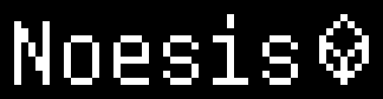

# Noesis

**An AI agent that plays Minecraft on its own**

 
     
     
     
     

---

## About

**Noesis** is an AI-powered agent/bot that plays Minecraft autonomously: it perceives the world, makes decisions, and acts in-game the way a real player would. The goal is to explore how far an intelligent agent can go operating in an open, complex, real-time environment like Minecraft.

> 🚧 **This project is just getting started.** No code has been published yet; this README sets the direction and structure of the project as development progresses.

## License

This project is licensed under the [MIT License](LICENSE).

---

  Made by <a href="https://github.com/iguakq">Iguaka</a>

